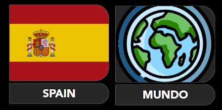
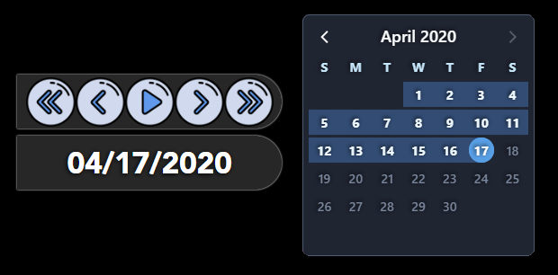
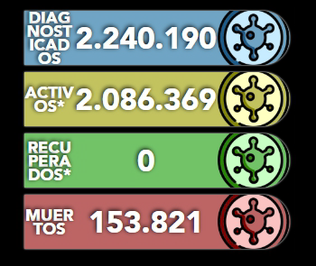
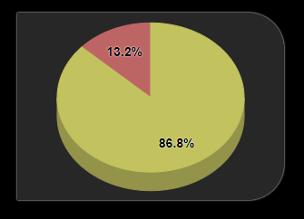
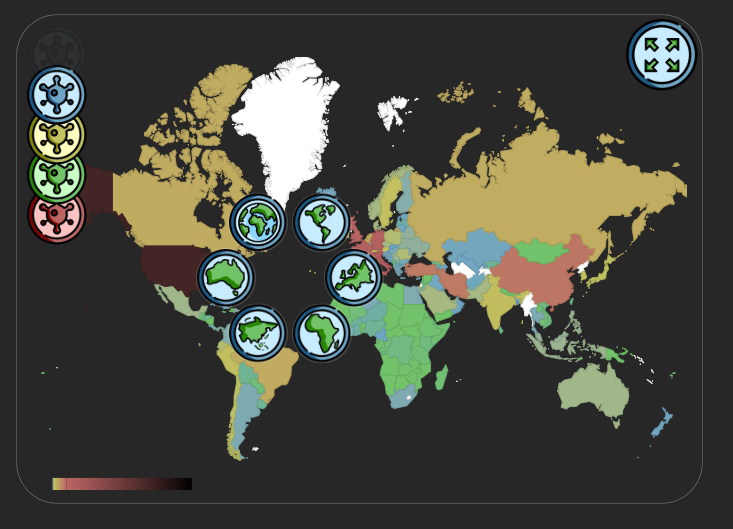
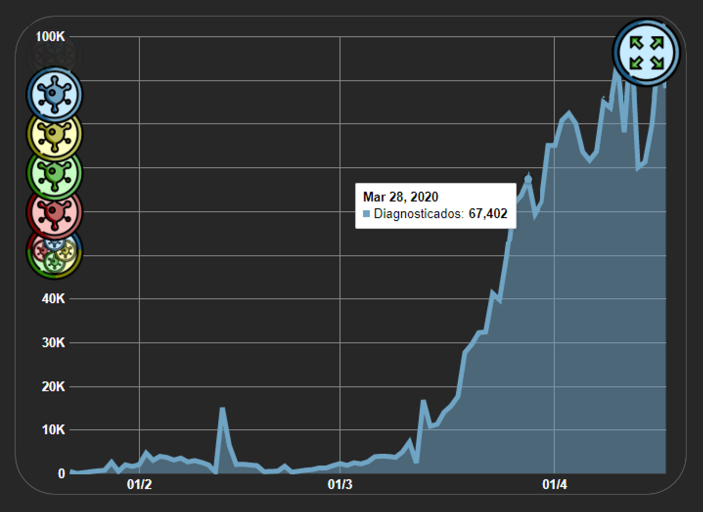
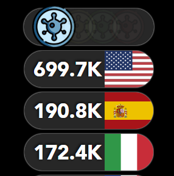
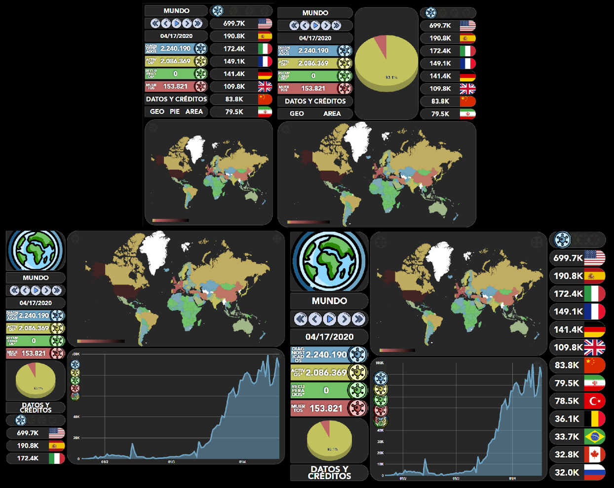

# COVID-19

Es una aplicación web que sirve para informar de forma interactiva la evolución del COVID-19 de la región seleccionada (Mundo/Continente/País) con la posibilidad de aplicar filtros y selección de fecha.

## INFO SOBRE EL PROYECTO

**Motivo:** Proyecto final de curso (DAW)

**Duración:** 2/20 - 4/20 (2 Meses)

Es el primer proyecto "grande" que desarrollo y más con un framework nuevo para mí, VUE. Me ha servido para entender un poco mejor el uso de computed, watchers, hooks y sobre todo el utilizar librerías externas en JS, ya que hasta ahora nunca las había usado. La parte negativa del proyecto es que desarrolle todo en un mismo componente y al final se ha quedado bastante "spaghetti" el código. Pero gracias a esta experiencia le doy más importancia al CLEAN CODE y he comprendido más la necesidad de usar lenguajes con un tipado más fuerte (TypeScript), test unitarios y organizar mejor el código al dividirlo por componentes. En el apartado Web Interactiva se puede probar la aplicación.

## WEB INTERACTIVA

- https://udsgit.github.io/covid-19

## REPOSITORIO USADO

- https://github.com/ExpDev07/coronavirus-tracker-api 

## GUÍA DE USO

### REGIÓN :pushpin:

> Indica la región seleccionada, mostrando su nombre y su imagen (bandera o icono) para saber a quien pertenece los datos mostrados en ese momento.

### FECHA :date:

> Indica la fecha actual de los datos mostrados, también se puede cambiar la fecha con los botones o con el calendario, y al darle al 'play' ira aumentando un día cada segundo hasta la última fecha disponible (todos los datos se actualizaran según la fecha actual).

### DATOS :label:

> Proporciona los datos actuales de los diagnosticados, activos, recuperados y muertos según la región y fecha seleccionados*.

### PIE CHART :dvd:

> Es un gráfico que nos proporciona de manera visual el porcentaje de la cantidad de personas activas, recuperadas y muertas. La suma total corresponde a los diagnosticados*.

### DATOS Y CRÉDITOS :credit_card:

> Proporciona información de donde se han obtenido los datos y informa de los créditos de los recursos utilizados por terceros (con sus enlaces), también explica el motivo de porque los datos de las personas 'activas' y 'recuperadas' no son correctos y hay un botón para activar un modo 'especial' para la web.

### GEO CHART :world_map:

> Representa en forma de mapa de calor la región seleccionada.

- **Filtros:** actualiza los datos del mapa según el filtro seleccionado (total diagnosticados, total activos, total recuperados o total - muertos).*
- **Agrandar/Achicar:** agrande el mapa para que ocupe todo el alto de la página ocultando el gráfico de área o lo vuelve a achicar activando ambos gráficos.**
- **Al pasar el ratón por encima:** muestra la etiqueta de la región seleccionada con sus datos (según filtro).
- **Al hacer click primario:** se selecciona dicha región y todos los datos correspondientes a la región seleccionada se actualizaran,  también el mapa mostrara dicha región.
- **Al hacer click secundario:** se desplegara un menú radial, con accesos directos a los continentes y al mundo, al seleccionar alguno actualizaran todos los datos correspondientes a la región seleccionada.
- **Leyenda:** muestra de menor a mayor la representación de los colores del mapa de calor.
Blanco ( 0 ), Verde ( 1 – 1.000 ), Celeste ( 1.000 – 10.000 ), Amarillo ( 10.000 – 100.000) , Rojo ( 100.000 – 1.000.000 ), Negro (  > 1.000.000 ).

### AREA CHART :chart_with_upwards_trend:

> Representa en forma de gráfico de área la evolución según el filtro de la región seleccionada.

- **Filtros:** actualiza los datos del área según el filtro seleccionado (diagnosticados diarios, activos diarios, recuperados diarios, muertos diarios y total todos).*
- **Agrandar/Achicar:** agrande el mapa para que ocupe todo el alto de la página ocultando el gráfico de mapa o lo vuelve a achicar activando ambos gráficos.**
- **Al pasar el ratón por encima o hacer click:** muestra una etiqueta con los datos de ese punto seleccionado.
- **Al mantener pulsado el click primario:** se puede seleccionar horizontalmente partes del gráfico para aumentar su tamaño y visualizarlo mejor.
- **Al hacer click secundario:** vuelve al tamaño normal.
- **Leyenda:** Muestra el número de datos en el eje vertical, y la fecha en el eje horizontal.

### RANKING MUNDIAL :trophy:

> Son los únicos datos que no están vinculados a la región seleccionada (pero si a la fecha), muestra de forma ordenada de mayor a menor el ranking mundial de los países según el filtro seleccionado, indica la cantidad redondeada y su bandera.

- **Filtros:** cambia el filtro del listado según el total de diagnosticados, total activos, total recuperados y total muertos*.
- **Click primario:** se selecciona dicha región y todos los datos correspondientes a la región seleccionada se actualizaran.
- **Rueda del ratón:** mueve verticalmente el listado.

### DISEÑO RESPONSIVO :iphone:

> Diseño responsivo que se adapta a todas las pantallas.

### DETALLES :warning:

- **Activos y recuperados:***  actualmente JHU CSSE (es la universidad de donde recogemos los datos oficiales)  han dejado de proporcionar los datos de las personas recuperadas, por lo tanto se muestra '0', como medida momentaria se ha desactivado varias funciones.
Todos los filtros correspondientes a las personas recuperadas están desactivados (incluye Geo Chart, Area Chart, Pie Chart, Ranking Mundial) y el calculo de los 'Activos' no es correcto ya que faltaría sumarle la cantidad de las personas recuperadas.

- **Agrandar/Achicar:**** Esta funcionalidad solo sirve para aprovechar las pantallas grandes, por lo tanto esta desactivado en pantallas pequeñas y medianas.
