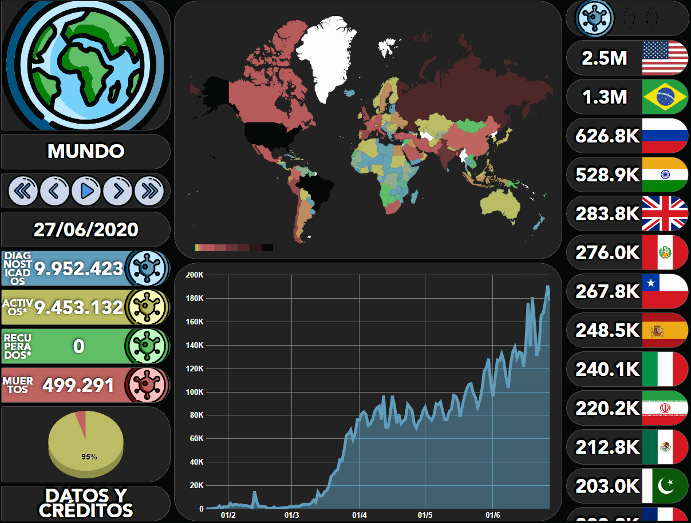
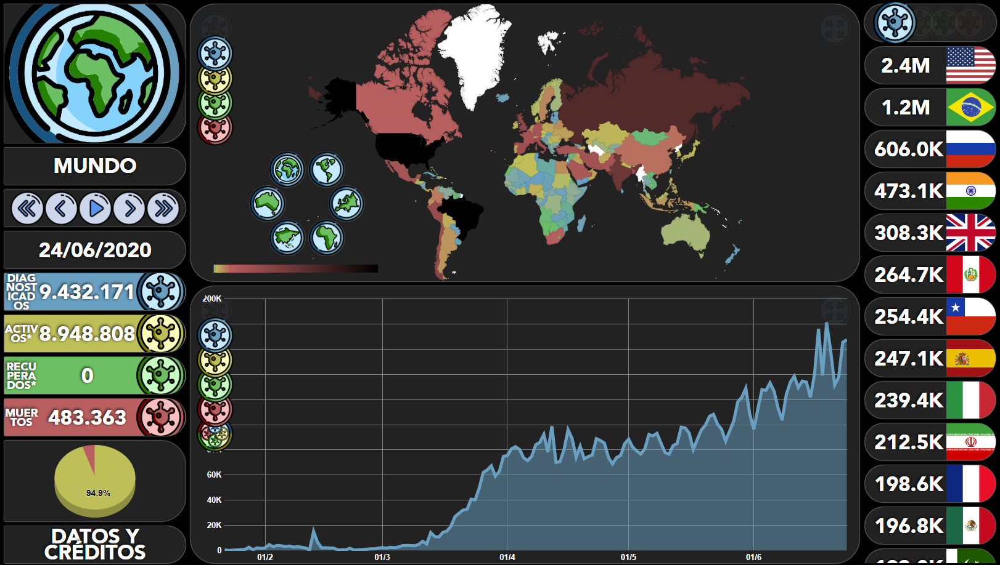

# **COVID-19**

Interactive web application about **COVID-19** 🦠 with graphs 📈, filter options, date 📅 and with a powerful [Wiki](https://github.com/udsgit/covid-19/wiki/Wiki).

## **Table of contents**

- [**COVID-19**](#covid-19)
  - [**Table of contents**](#table-of-contents)
  - [**General info**](#general-info)
  - [**Demo**](#demo)
  - [**Screenshots**](#screenshots)
  - [**Technologies**](#technologies)
  - [**Setup**](#setup)
  - [**Usage**](#usage)
  - [**Status**](#status)
  - [**Contact**](#contact)

## **General info**

**Date**: February, 2020.  
**Duration**: 2 Months.

I started this project because I needed a final project to finish my associate degree (DAW) and it was my first "big" project. Since I wanted a challenge, I wanted to take advantage and learn **Vue** and use external libraries. For this reason, many sections of the web are in Spanish.

I've finally got it but I have made many development failures and for not developing each component separately finally the code has become too long and not very scalable and usable 😔, but it has helped to value more the **Clean Code** and I hope that my next project is divided into components as well as using TypeScript and some kind of test 😀.

Another penalty of the project is that at the beginning of using the REST API, **JHU** provided the data of the recovered people. Thanks to this, it was able to give the information of the recovered and active people (all diagnosed except the recovered and dead), but a few months ago, unfortunately, JHU stopped providing such information and it was a cold water hit. For this reason it is because 0 recovered are shown and the active people are not real, since they still need to subtract the recovered ones.

> ## **Recovered cases showing 0**
>
> **JHU** (our main data provider) no longer provides data for amount of recoveries, and as a result, the API will be showing 0 for this statistic. Apologies for any inconvenience. Hopefully we'll be able to find an alternative data-source that offers this.

https://github.com/ExpDev07/coronavirus-tracker-api#recovered-cases-showing-0

## **Demo**

You can try it using the [Demo](https://udsgit.github.io/covid-19), but I recommend that you first take a look at the [Wiki](https://github.com/udsgit/covid-19/wiki/Wiki) to know all the functionalities.

> <br><i>Demo</i>

## **Screenshots**

> <br><i>Web example with all filters visible</i>

## **Technologies**

- **Html**
- **Css**
- **JavaScript**
- [**Vue**](https://vuejs.org/)
- [**Bootstrap 4**](https://getbootstrap.com/docs/4.1/getting-started/introduction/)
- [**Sass**](https://sass-lang.com/)
- **Libraries**
  - [**Vue-Google-Charts**](https://github.com/devstark-com/vue-google-charts)
  - [**V-Calendar**](https://vcalendar.io/)
  - [**Flag-Icon-Css**](https://github.com/lipis/flag-icon-css)
- **Api rest**
  - [**Coronavirus-Tracker-Api**](https://github.com/ExpDev07/coronavirus-tracker-api)

## **Setup**

This project was not planned so you can continue it and more with the madness of having everything in one component, but if you want to try anyway, here are the steps...

1. Clone/Download the repository.

```console
git clone https://github.com/udsgit/covid-19.git
```

2. Move to the directory **src** and create a new file called **keys.json**.
3. Edit the previous file and add the following lines replacing **_YOUR KEY_** with your google chart api credential.

```yaml
{ "API_KEY": "YOUR KEY" }
```

4. You may have to install the packages with **NPM**.

```console
npm install
```

5. If you had an error, you will have to manually install some dependency.
6. And remember that to run the project, you will have to build it to generate the file **index.html**.

## **Usage**

1. Open the link from the [Demo](https://udsgit.github.io/random-teg) or open the file **index.html** if you followed the previous steps.
2. The first load maybe takes a few seconds to fetch the data from the API, so be patient 🙃.
3. When everything is already loaded you can use it.
4. Finally, I recommend you look at the [Wiki](https://github.com/udsgit/covid-19/wiki/Wiki) that I have created that explains each sections for what it is for and how it works, even with screenshots 👍.

## **Status**

Project is: **_Completed._**

Because I have managed to do what I wanted, but it is likely that from time to time I will make a commit adding or correcting things.

## **Contact**

Created by [@Emmanuel](https://www.linkedin.com/in/emagleza/), feel free to contact me!
